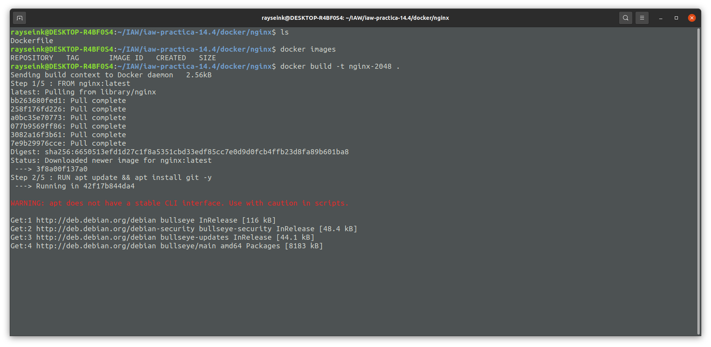
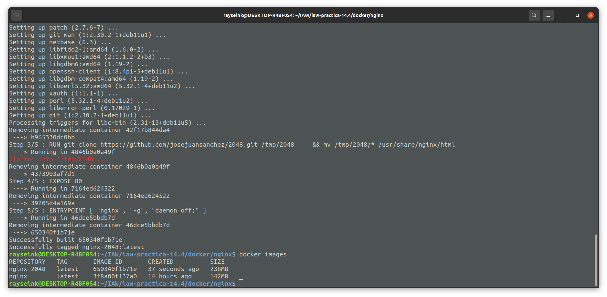
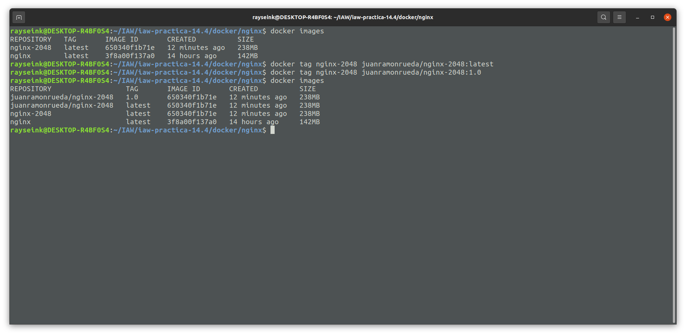
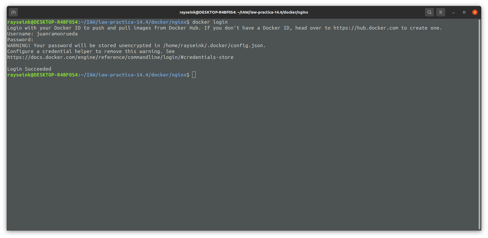
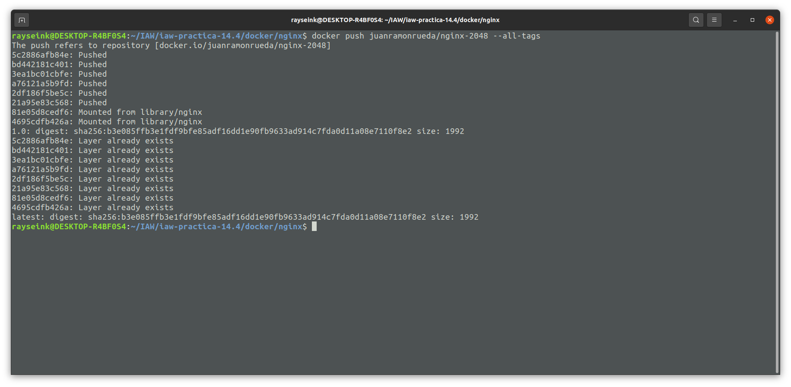
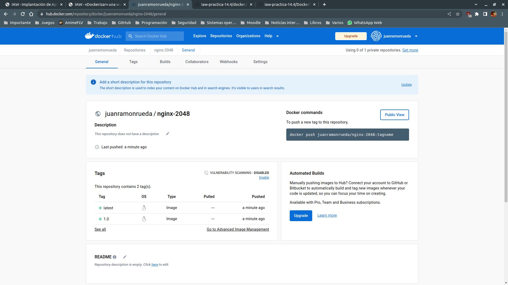
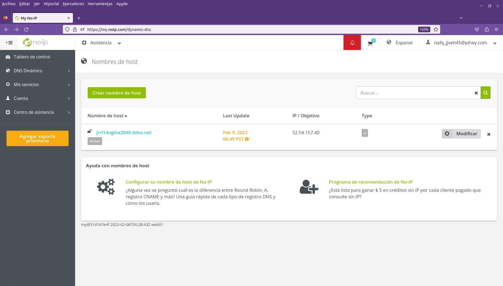
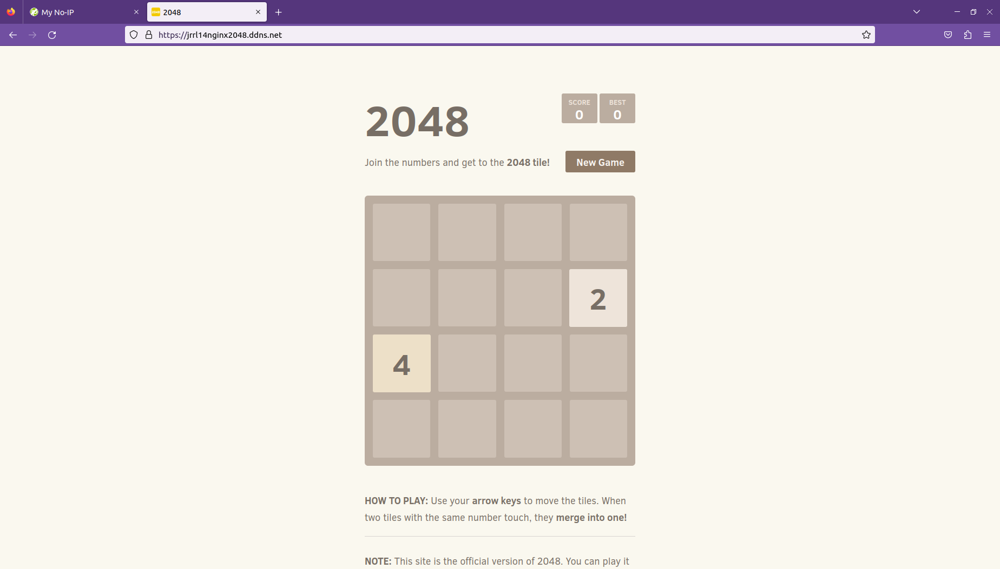
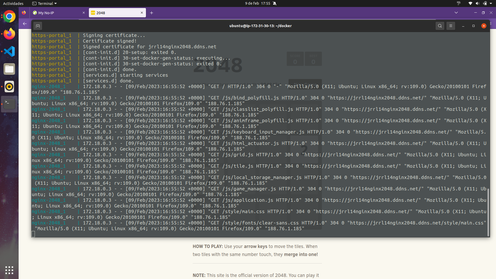

# iaw-practica-14.4

En esta práctica realizaremos nuestra propia imagen de Docker para preparar una aplicación web **mediante el archivo Dockerfile** y con el archivo *Dockerfile* realizaremos el despliegue de nuestra aplicación web convertida en un contenedor de Docker.

**Partiremos del código de Ansible y Terraform de las dos práctica anteriores** ya que es genérico y nos permite ahorrar trabajo. Crearemos un repositorio y lo clonaremos en nuestra máquina local. Prepararemos la siguiente estructura del repositorio:

+ **ansible**
  + **inventario**
    + inventario --> Archivo

  + **playbooks**
    + delete_compose.yaml

    + deploy_compose.yaml

    + install_docker.yaml

  + **vars**
    + variables.yaml

  + main.yaml

+ **docker**
  + **nginx**
    + Dockerfile
  
  + .env --> Archivo

  + docker-compose.yaml

+ **terraform**
  + main.tf

  + variables.tf

## docker

Mediante Docker realizaremos dos partes, la primera que será preparar el archivo *Dockerfile*, comprobar que funciona, crear una imagen a partir del archivo y subir nuestras imágenes a [Docker Hub](https://hub.docker.com/); la segunda parte será crear un archivo docker-compose.yaml para **desplegar la imagen mediante el archivo Dockerfile** en una instancia de AWS con un dominio y comprobar que podemos acceder a la aplicación web.

***Antes de continuar, crearemos la cuenta en Docker Hub***.

### Dockerfile

En este archivo definiremos nuestro contenedor, usaremos como base y primera capa la imagen de *Nginx* en su última versión usando *FROM*, después crearemos una capa mediante el *RUN* que también nos permite definir las características de nuestro contenedor. En la segunda capa vamos a realizar la actualización de los repositorios y la instalación de *GIT*. En la tercera capa clonaremos un repositorio en la ruta */tmp/2048* dentro de la imagen y moveremos el contenido descargado a */usr/share/nginx/html*, dónde se colocan los sitios web que se van a servir.

A continuación, expondremos el puerto 80 de la imagen mediante *EXPOSE*, esta parte no es necesaria. Y por último, proceso que se ejecutará dentro del contenedor será ***nginx -g daemon off;***, en *ENTRYPOINT* para que el contenedor sirva su contenido web y no muera al finalizar la ejecución del proceso.

```Dockerfile
FROM nginx:latest

RUN apt update && apt install git -y 

RUN git clone https://github.com/josejuansanchez/2048.git /tmp/2048 \
    && cp -R /tmp/2048/* /usr/share/nginx/html

EXPOSE 80

ENTRYPOINT [ "nginx", "-g", "daemon off;" ]
```

#### Creación de imagen mediante Dockerfile

Para crear una imagen a partir del archivo *Dockerfile*, ejecutaremos:

```bash
docker build -t nginx-2048 .
```

Con el argumento *build* convertimos el archivo Dockerfile a imagen y con el modificador *-t nginx-2048* asignamos el *tag o nombre nginx-2048* a la imagen y **con el dot** (o punto) **indicamos el directorio actual en el caso de encontrarnos en el directorio en el que está el archivo Dockerfile**, en caso contrario, *cambiaremos el dot por la ruta en la que se encuentra el archivo*.



Una vez haya terminado de crearse la imagen, usaremos el comando ***docker images*** para comprobar que se ha creado correctamente la imagen.



En este caso subiremos la imagen a Docker Hub, por lo que cambiaremos el nombre de la imagen para indicar **primero nuestro nombre de usuario en Docker Hub**, después **el nombre de la imagen y la versión**, en este caso la versión latest y la 1.0:

```bash
docker tag nginx-2048 juanramonrueda/nginx-2048:latest

docker tag nginx-2048 juanramonrueda/nginx-2048:1.0
```



A continuación, iniciaremos sesión en Docker Hub mediante la consola de comandos con:

```bash
docker login
```

Pondremos nuestro usuario y contraseña.



Para finalizar esta parte, subiremos desde la consola de comandos las dos imágenes a Docker Hub mediante:

```bash
docker push juanramonrueda/nginx-2048:1.0

docker push juanramonrueda/nginx-2048:latest
```

Ó

```bash
docker push juanramonrueda/nginx-2048 --all-tags
```

Sin el modificador *--all-tags* ó *-a* tendremos que subir la imagen y todas las versiones que tiene una a una, en cambio con *--all-tags* indicamos la imagen base y sube todas las versiones que hay de dicha imagen.



En Docker Hub, *accederemos a Repositories* y veremos que tenemos nuestro repositorio subido, accedemos a dicho repositorio y vemos que están las dos versiones de nuestra imagen.



### .env

Una vez hayamos terminado de subir las imágenes a Docker Hub, procederemos con la última parte, usar el archivo Dockerfile para crear un contenedor desde el archivo docker-compose.yaml. Empezaremos con el archivo de variables.

En este caso no tenemos una infraestructura grande, por lo que únicamente necesitaremos una variable para establecer el dominio que tendrá nuestra instancia de AWS.

```env
WEB_DOMAIN=jrrl14nginx2048.ddns.net
```

### docker-compose.yaml

En este caso, aunque podamos usar nuestra imagen de Docker, ***haremos algo diferente y usaremos el archivo Dockerfile que está en el directorio nginx***.

Estableceremos la versión en base a la versión de Docker Engine instalada, normalmente será la última. Después, definiremos los servicios que queremos desplegar, **crearemos un servicio con el nombre nginx-2048** y usaremos *build* para indicar que "construya" nuestro archivo *Dockerfile* que se encuentra en el directorio nginx. Para terminar con este contenedor, *estableceremos la network frontend-network*.

```yaml
version: '3.8'

services:
  nginx-2048:
    build: ./nginx
    networks:
      - frontend-network
```

Para finalizar con los servicios, definiremos el servicio de https-portal para dar a nuestra aplicación web un dominio junto con TLS / SSL.

```yaml
  https-portal:
    image: steveltn/https-portal:1
    ports:
      - '80:80'
      - '443:443'
    volumes:
      - ssl_certs_data:/var/lib/https-portal
    environment:
      DOMAINS: '${WEB_DOMAIN} -> http://nginx-2048:80'
      STAGE: 'production'
    restart: always
    networks: 
      - frontend-network
```

Por último en el archivo, estableceremos las *networks* que hemos usado con los servicios y el volumen de https-portal.

```yaml
networks:
  frontend-network:

volumes:
  ssl_certs_data:
```

#### Ejecución de docker-compose.yaml

Primero inicializaremos el directorio de terraform en el que se encuentra en archivo main.tf y el archivo de variables con el comando:

```bash
terraform init
```

Después, crearemos la instancia con el grupo de seguridad y sus puertos, el de TCP SSH (22), TCP HTTP (80) y TCP HTTPS (443), en la ruta en la que se encuentran mediante el comando:

```bash
terraform apply -auto-approve
```

Con la IP elástica que nos devuelva la ejecución del comando, la usaremos para el archivo *inventario* de Ansible y para el dominio de No-IP.



Ejecutaremos el archivo main.yaml de ansible mediante:

```bash
ansible-playbook -i inventario/inventario main.yaml --extra-vars "instalar=docker desplegar=compose"
```

Una vez haya terminado de ejecutarse el comando, esperaremos unos minutos y accederemos al dominio asignado a la instancia.



Por último, accederemos a la instancia mediante SSH y al directorio en el que se encuentra el archivo docker-compose.yaml y comprobaremos los logs generados, ejecutaremos:

```bash
docker compose logs -f
```

Refrescaremos la página web y comprobaremos que se actualizan los logs.


